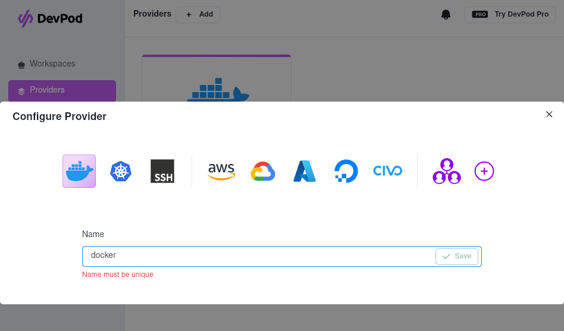
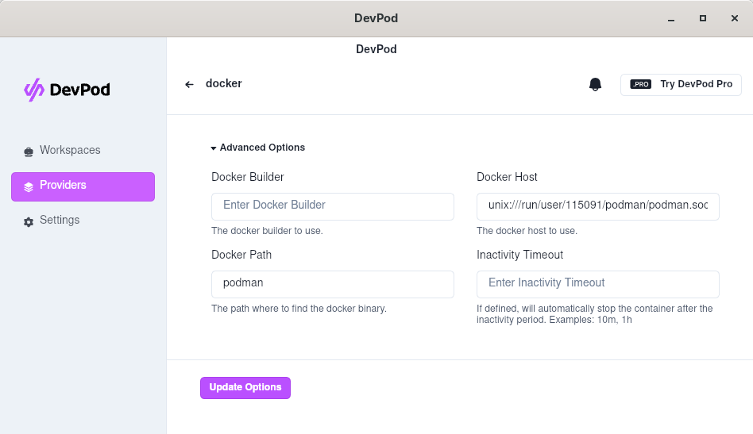

# Podman

Start Podman service for a regular user (rootless) and make it listen to a socket:

```shell
systemctl --user enable --now podman.socket
```

Restart your OS if necessary and verify that podman listens:

```shell
systemctl --user status podman.socket
```

Set up the DOCKER_HOST ENV:

```shell
if [ -z "DOCKER_HOST" ]; then echo "export DOCKER_HOST=unix://$XDG_RUNTIME_DIR/podman/podman.sock" >> ~/.bashrc; fi
```

# DevPod

- Create a new Docker provider named `docker`:



- Set up your provider configuration:
    - Docker Path: `podman`
    - Docker Host: `unix:///run/user/$XDG_RUNTIME_DIR/podman/podman.sock` replace `$XDG_RUNTIME_DIR` by its real value



## Init Dev containers

- Setup Envs for pointing the local git repositories:

```shell
if [ -z "$TRUSTIFY_PATH" ]; then echo "export TRUSTIFY_PATH=\$HOME/git/trustification/trustify" >> ~/.bashrc; fi
if [ -z "$TRUSTIFY_UI_PATH" ]; then echo "export TRUSTIFY_UI_PATH=\$HOME/git/trustification/trustify-ui" >> ~/.bashrc; fi
```

- Trustify:

```shell
sed "s|\${localEnv:UID}|$UID|g" ./trustify/.devcontainer/devcontainer.json > ./trustify/.devcontainer/devcontainer.tmp.json && \
devpod up $(pwd)/trustify/.devcontainer \
--devcontainer-path devcontainer.tmp.json \
--id trustify \
--provider docker \
--ide vscode
```

- Trustify-ui:

```shell
sed "s|\${localEnv:UID}|$UID|g" ./trustify-ui/.devcontainer/node/devcontainer.json > ./trustify-ui/.devcontainer/node/devcontainer.tmp.json && \
devpod up $(pwd)/trustify-ui/.devcontainer/node \
--devcontainer-path devcontainer.tmp.json \
--id trustify-ui \
--provider docker \
--ide vscode
```

- Trustify-e2e:

```shell
sed "s|\${localEnv:UID}|$UID|g" ./trustify-ui/.devcontainer/e2e/devcontainer.json > ./trustify-ui/.devcontainer/e2e/devcontainer.tmp.json && \
devpod up $(pwd)/trustify-ui/.devcontainer/e2e \
--devcontainer-path devcontainer.tmp.json \
--id trustify-e2e \
--provider docker \
--ide vscode
```